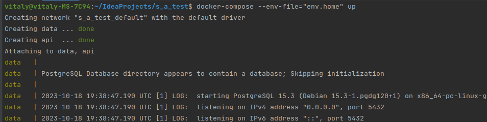
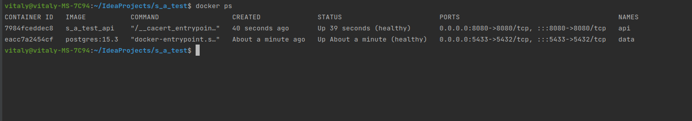
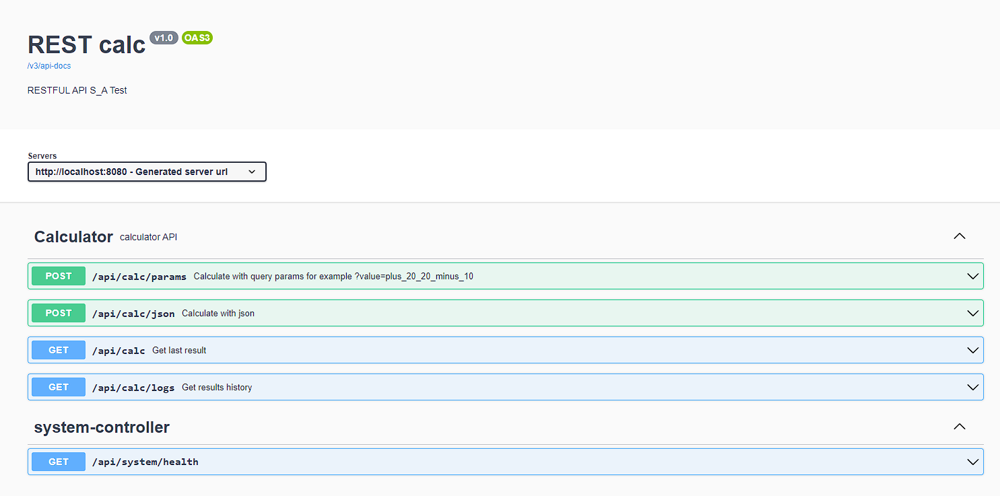

## REST API calculator

### Использованные технологии

* PostgresSQL 15.3
* Spring Boot 3.1
* Spring JPA
* Liquibase 4.20
* Docker
* Lombok
* Junit 5
* Mockito
* H2 Database
* Swagger

### Требование к окружению

* Docker
* Docker-compose

### Запуск проекта
1. Установить Docker
2. Установить Docker-compose
3. Скачать проект из репозитория
4. Через терминал перейти в папку проекта и введите команду:
```shell
docker-compose --env-file="env.example" up -d
```
 
5. С помощью команды убедиться, что контейнеры поднялись и состояние было healthy:
```shell
docker ps
```

7. Открыть URL http://localhost:8080/swagger-ui/index.html#/:


Для запуска проекта со другими переменными среды необходимо создать env.local 
и тогда команда для поднятия ресурсов поменяется: 
```shell
docker-compose --env-file="env.local" up -d
```
### Контакты
vithag97@mail.ru